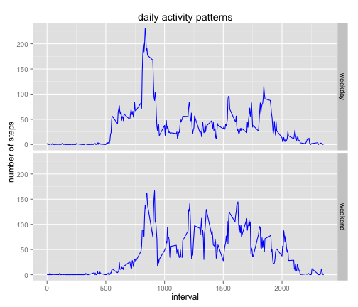

# Reproducible Research: Peer Assessment 1


## Loading and preprocessing the data

```r
data <- read.csv("activity.csv")
data$date <- as.Date(data$date,"%Y-%m-%d")
```


## What is mean total number of steps taken per day?

```r
daily_step <- tapply(data$steps, data$date, sum, na.rm = TRUE)
hist(daily_step,breaks = 10, col = "lightblue", main = "histogram of total steps per day", xlab = "number of steps per day")
```

 

```r
daily_step_mean <- mean(daily_step)
daily_step_median <- median(daily_step)
```

The mean total daily steps is 9354.2295, and the median of total daily steps is 10395.

## What is the average daily activity pattern?

```r
mean_inter_step <- tapply(data$steps, data$interval, mean, na.rm = TRUE)
plot(unique(data$interval), mean_inter_step, type = "l", col="blue", main = "average daily activity pattern",
     xlab = "interval", ylab = "average steps")
```

 

```r
max_interval <- data$interval[which.max(mean_inter_step)]
```

The 835th contains the maximum number of steps across all days.

## Imputing missing values

```r
#fill NA with mean of the interval
num_NA <- summary(data)[7,1]
library(plyr)
data2 <- ddply(data, .(interval), function(df){
    df$steps[is.na(df$steps)] <- mean(df$steps, na.rm=TRUE)
    return (df)
})
daily_step2 <- tapply(data2$steps, data2$date, sum, na.rm = TRUE)
hist(daily_step2,breaks = 10, col = "lightblue", main = "histogram of total steps per day (NA filled)", xlab = "number of steps per day")
```

 

```r
daily_step2_mean <- mean(daily_step2)
daily_step2_median <- median(daily_step2)
```

The total number of "NA" is NA's   :2304  .By filling in the "NA"" values, the new mean total daily steps is 1.0766 &times; 10<sup>4</sup>, and the new median of total daily steps is 1.0766 &times; 10<sup>4</sup>, both larger than the original "NA" removed results.

## Are there differences in activity patterns between weekdays and weekends?

```r
data2$days <- factor(c("weekend","weekday"))
library(chron)
data2$days[is.weekend(data2$date)] <- as.factor("weekend")
data2$days[!is.weekend(data2$date)] <- as.factor("weekday")
data3 <- ddply(data2, .(days, interval),summarize, mean_step = mean(steps))
library(ggplot2)
p <- ggplot(data3, aes(x = interval, y = mean_step))
p + geom_line(colour = "blue") + facet_grid(days ~.) +labs(title="daily activity patterns",y="number of steps")
```

 

There are some differences in activity patterns between weekdays and weekends.
